## auszeichnungen (h2 'doppelraute am anfang')

Weit hinten, hinter den Wortbergen, fern der Länder Vokalien und Konsonantien leben die Blindtexte. Abgeschieden wohnen sie in Buchstabhausen an der Küste des Semantik, eines großen Sprachozeans. Ein kleines Bächlein namens Duden fließt durch ihren Ort und versorgt sie mit den nötigen Regelialien. Es ist ein paradiesmatisches Land, in dem einem gebratene Satzteile in den Mund fliegen. Nicht einmal von der allmächtigen Interpunktion werden die Blindtexte beherrscht – ein geradezu unorthographisches Leben. Eines Tages aber beschloß eine kleine Zeile Blindtext, ihr Name war Lorem Ipsum, hinaus zu gehen in die weite Grammatik. (fließtext ohne auszeichnung)

**fett (strong 'doppelsternchen vorne und hinten')**

*italic (em 'einfaches sternchen vorne und hinten -> bildunterschriften')*



def foo
  puts 'foo'
end

code syntax:
{ % highlight ruby %}
{ % endhighlight %}




<span class="note">note ('< span class="note">< /span> ohne das leerzeichen nach spitze klammer auf)</span>


## Workspace

no picture

## End Result


## Laser-cutting
+ bond mirror film with cardboard before lasering!
+ load provided illustrator file ```bellow``` to your laser-cutter
+ try cut settings with test piece of mounted mirror-film on cardboard
+ laser-cut sheet
+ have the metal piece professionally produced, all holes with need to have a M3 female screw thread

## Prepairing Coating

**for the following steps it is recommended to work in pairs of two**

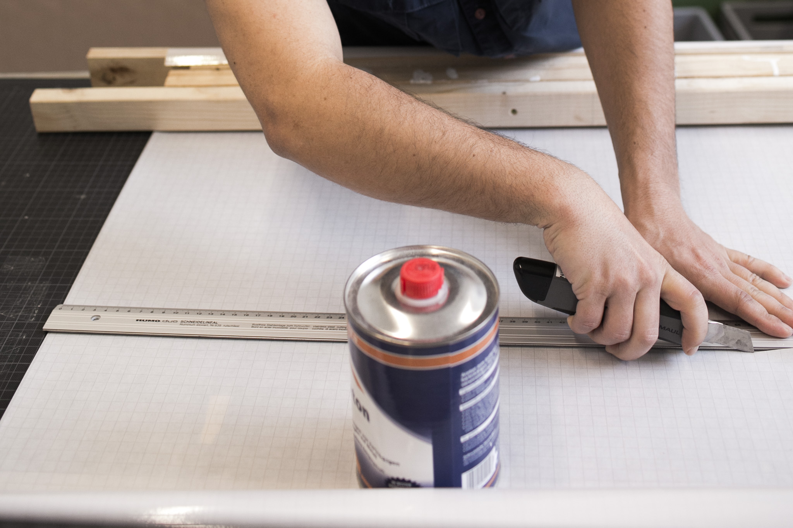
*cut transfer adhesive film to 50 x 100cm*

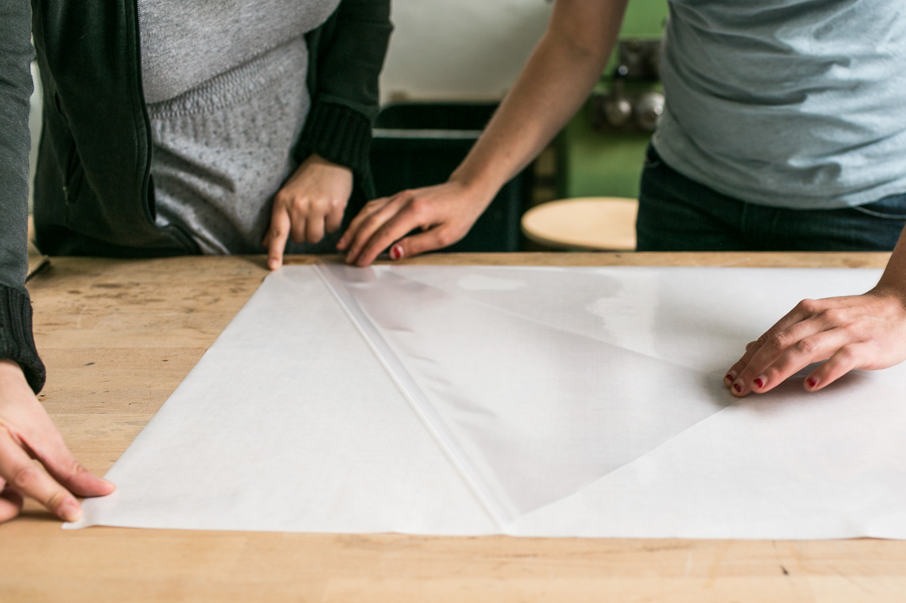
*removing film from paper, start at one courner and pull diagonal and parallel to surface*


*One positions the transparent film parallel to the end of lasered sheet (mirrored side up!) the other is holding up the other end of the film. take care that the film has a more or less überstand at each side of the cardboard*


wait about 10 min before mounting moscito net on cardboard, adhesive spray needs to be dry


## Coating


<span class="note">put on vynil gloves, and repeat coating three times. thin layers of latex are better, wait for one layer to fully dry until you apply the next layer. this takes more or less 2 hours.</span>


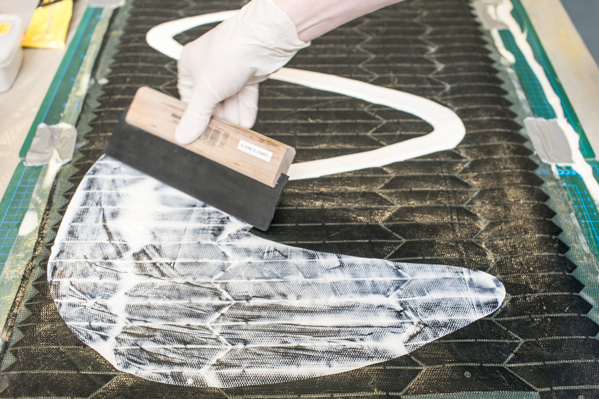


## Prepairing Putting


## Putting

Again for the following steps it is much easier to work with somebody who can give you hand.


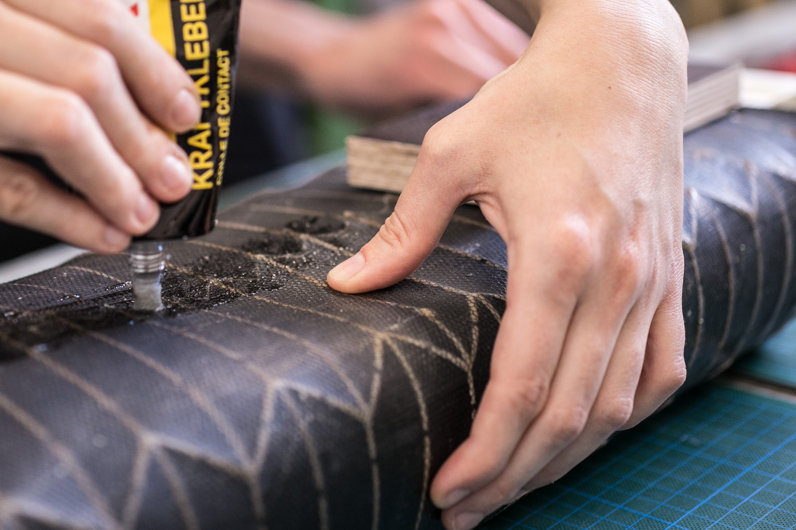

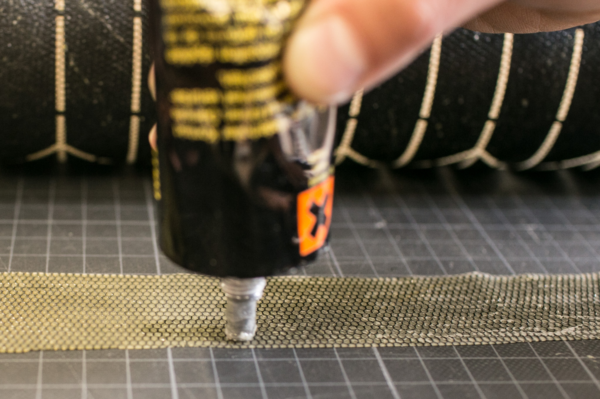

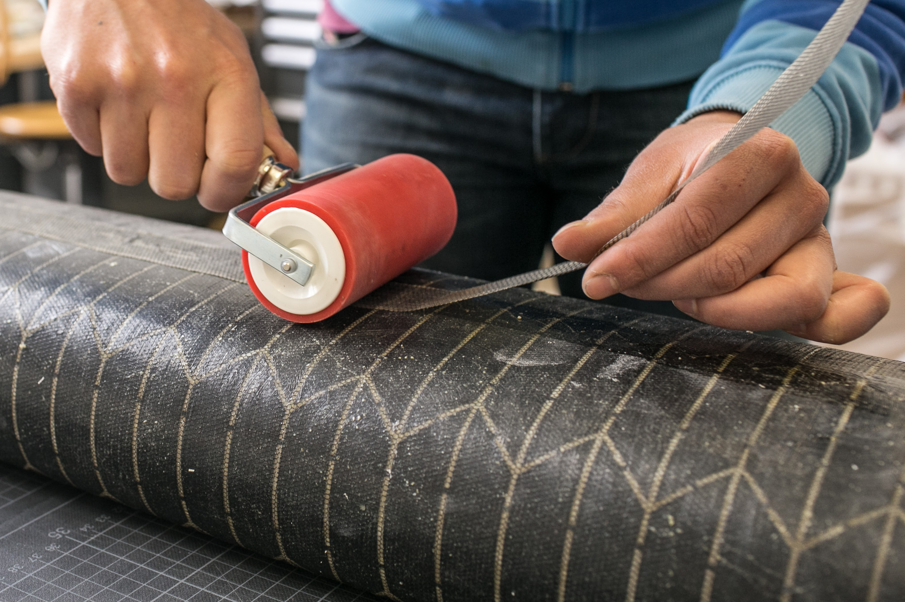

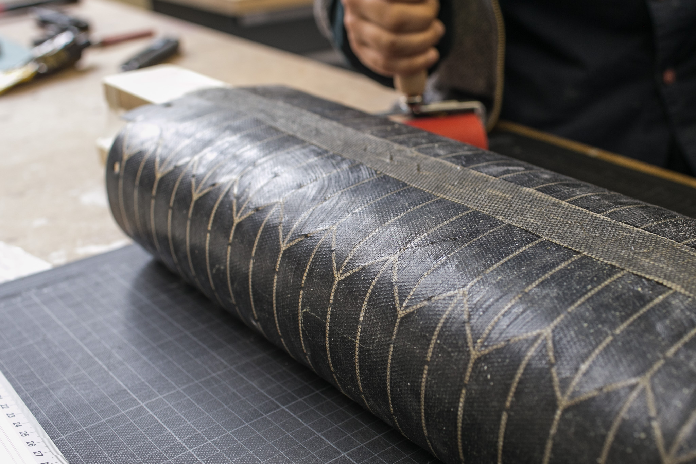


## Folding


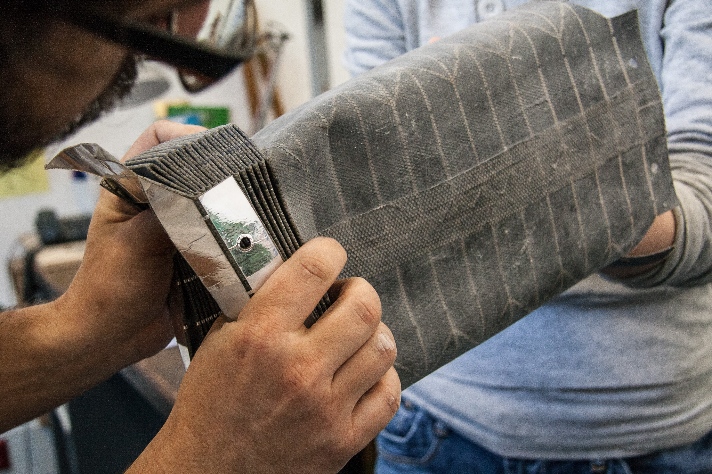

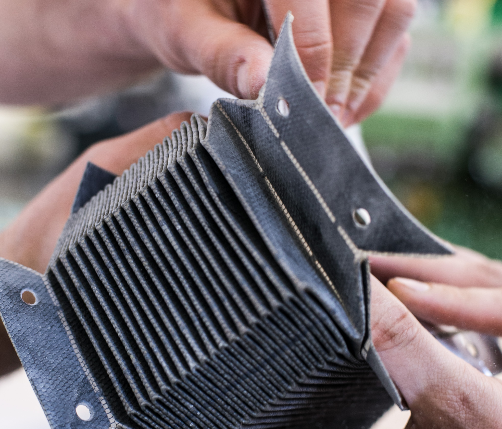


## Glueing

while glueing in the metall frames at each end of the bellow work with another person. before glueing make sure metall parts are fat and dust free. Glue one frame at a time since the epoxy hardens quiet fast!


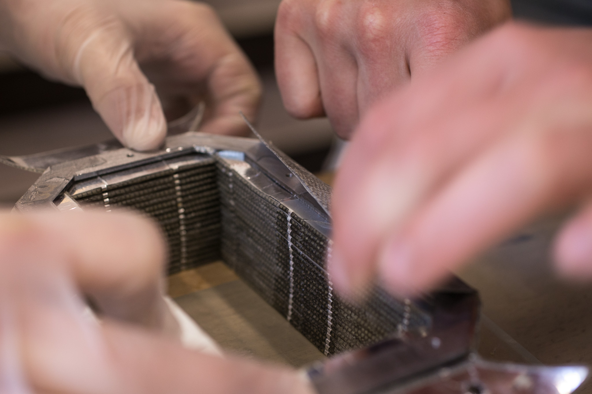

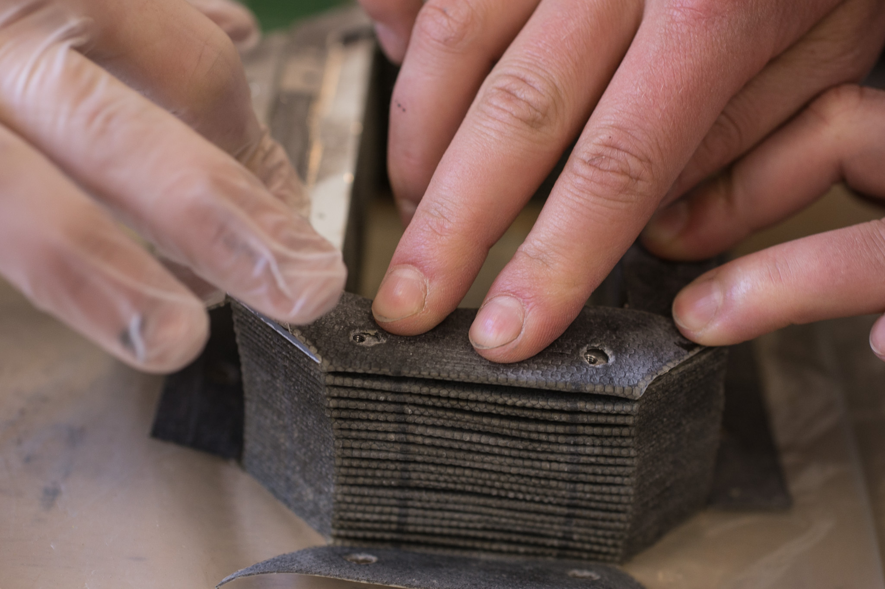


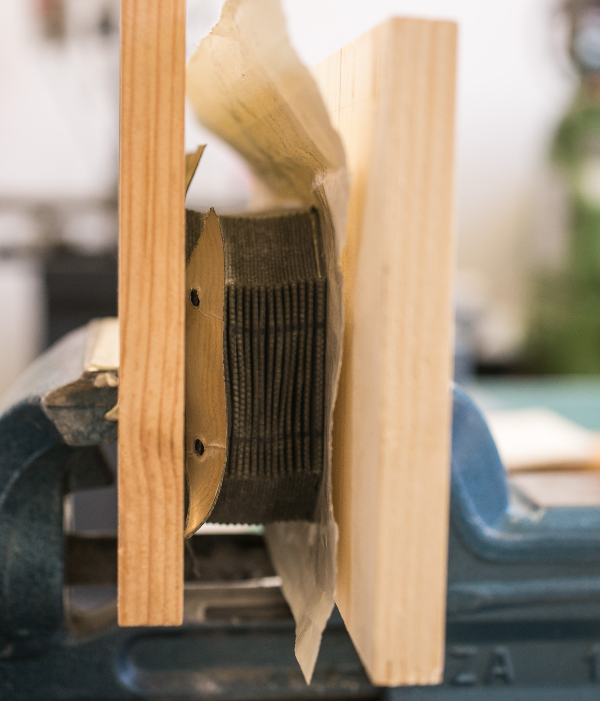


