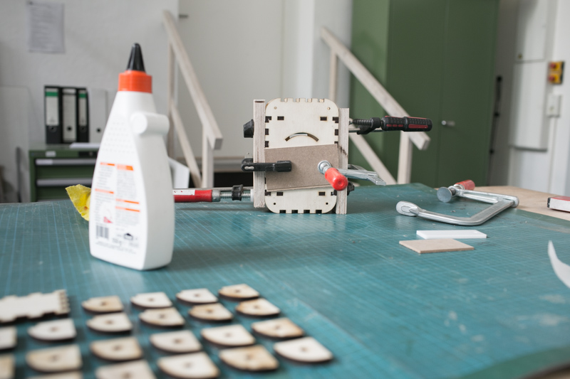

## Workspace


*Tabletop with vise*

## Photos of tools


*Forstner Drill*


*Drilling machine with drill*


*Sanding equipment, filler*


*Wood glue, c-clamps, brushes, screws*


## End Result


*Glued box from the front*


*Glued, sanded and filled box from top*


## Laser-cutting


*laser-cut wooden parts and spacer bolts*

Use the illustrator file ```box-wood``` to laser-cut the parts from the plywood piece.

<span class="note">Before using your actual material, try the lasercutter and its settings with a scrab-piece of plywood.</span>


## Drilling


*Fix the left wall in a drilling vise.*


*Center the Forstner drill to the center hole.*


*Drill away 1.5mm of the material.*


*Change to a 20mm wood drill and make a hole at the center of the pit.*


## Dry run assembly


Before gluing the pieces into the box, put them together without glue to check if everything fits.


<span class="note">Note that the shape of the elements does allow more than one way to create a box. Be careful to not swap elements or put them in inside-out.</span>

The back element has four slits, whereas the front has four squares. 
The left side has a center hole and the right side two holes which should ne located on the front-right side of the box.


Seven Tower pieces (3 with and 4 without cutaways) stack to a tower with a hole in the middle for the hexagonal spacer bolts. 
Use a hexagonal spacer bolt for the stacking, this way you make sure to put them in the right direction.


*Tower pieces stacked with the hexagonal spacer bolt inside*


*Front view with right tower assembled.*


The jigsaw shape of the towers should fit neatly into the corresponding front and back elements. However, depending on quality and source, plywood can be more or less thick. If yours is too thick (>0.6mm), sand down the Tower pieces such that they fit into the teeth of the sides.

<span class="note">If the plywood is too thin, you can fill the gaps later with filling material or, if you know what you are doing, by adding sawdust to the glue you put between the tower elements.</span>


*Sand down Tower pieces.*


When you completely assembled the box, it is time to prepare the pieces such that you will be able to easily put them together for the glueing.
For this, mark all parts of the box facing inwards with a cross. and then disassemble it piece by piece and put its elements on the table, their insides (or top in case of the bottom, top and tower elements) facing upwards.


*Mark all parts of the box facing inwards with a cross.*


*Disassemble with insides facing upwards. Tower elements are put in their sequence to the four corners of the bottom element.*


Mark the top sides of the tower elements with numbers 1–7 to ensure them being glued in the same order.


*Final layout before glueing*


## Glueing

<span class="note">Glueing is best done with two people. While one puts the pieces together, the other prepares them with glue.</span>
<span class="note">Do *not* glue the top element to the box!</span>

The process of glueing should take you no more than 10 minutes, otherwise you risk the wood glue to dry and harden without the needed pressure. When done witht the glueing, immediatly continue with [clamping the box](#drying-and-clamping).
Put glue to all the places that will stick to each other. 
Spread it with a brush if necessary.

Start with the base and first add left and right elements, followed by front and back walls.

Then, one by one, put the Tower pieces into place. 
They need to be attached to the front/side parts, too, so they need glue applied there as well. 
Take care to stack its pieces in the right order and with the marked side facing up (otherwise the hexagonal bolt will not fit).
When finnished one tower, push a hexagonal spacer bolt through its hole. 

*Do not glue the lid!*

During glueing, wipe away excess glue with a damp cloth. Everything you do not remove now will be difficult to remove once the glue is hardened.


*Put glue to all the places that will stick to each other. spread with a brush if necessary.*


*The corner towers need to be attached to the front/side parts, too.*


*For an even spread of the glue, apply it first to one side, then rub it carefully to the next piece.*


*When building the towers, take care to stack its pieces in the right order and with the marked side facing up. Otherwise the hexagonal bolt will not fit.*


*Push the bolt into place.*


*An assembled corner*

## Drying and clamping

For the glue to hold, the assembled structure needs to be clamped down for at least on hour. To apply pressure evenly, the lid is added to the structure *without applied glue*. 

After adding the lit, screw the parts firmly (but not too tightly) together by fiting the screws into the spacer bolds. Use one washer on each screw to prevent markings in the wood.
Fix the structure with c-clamps and wood blocks. To keep the wooden blocks from attaching to the box (e.g. because of additional excess glue), put newspaper pieces between them and the box.
After about one hour, release the c-clamps. Your box should now be assembled.

<span class="note">Wait at least one hour before continuing to work on of with the box.</span>


*Clamped part, top view.*


*Clamped part, side view.*

## Sanding

To prepare for the surface finnish, e.g. painting or oiling, the box needs to be sanded.
For this, fix it to a vise using wooden spare parts to protect it from the metal. 
Sand it from all sides with P100 sanding paper, either by hand or with a machine.
Particulalry sand away irregularities, there will be some especially at the rounded corners of the box.

To prevent dents and irregularities, use a sanding block at all times and round the corners by hand, not with the sanding machine.
Always start at a flat surface. From there, go over the round corner until you reach the next flat surface.


*To sand a corner, start at a flat surface.*


*Go smoothly over the round corner until you reach the next flat surface.*


*Fix the box in a vise with wooden blocks to protect it from dents.*


*Working with a sanding machine.*


## Filling

Holes and dents in the box' surface can be closed by the application of filling material.
For the 2K filling material to work, tis two components needs to be mixed together thorroughly. For this, take some of the first material and put it to a wooden surface, then add a small amount of the second material and mix the two components with a spatula. 

<span class="note">Mix only as much as you will be able to use within the next 10 minutes</span>

Apply it with a scraper to the groves and cracks and remove excess immediatly.

<span class="note">Remove excess material when it is still fresh; dry material gets very hard and therefore takes a lot of time to sand away.</span>


*Fill groves and cracks with filling material using a scraper.*


*A box with way too much filling material.*


## Filing

The lid of the box should get on and off easily. To ensure this, it is necessary to file away parts of its teeth. 

Fix the lid in a vise and carefully file away parts of the teeth with a flat file.
The use of a square file supports you to keep a right angle also in the corners.

<span class="note">Be careful when taking away the material and be prepared to try several times if the lid fits snug. It is not possible to re-apply filed-off material.</span>


*Fix the lid in a vise.*


*Carefully file away parts of the teeth with a flat file.*


*A square file helps to keep the angle right.*
