## Materials

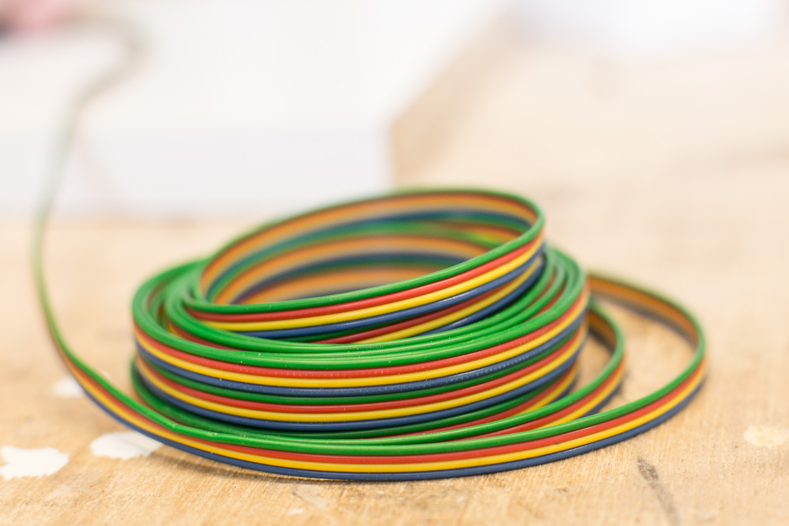

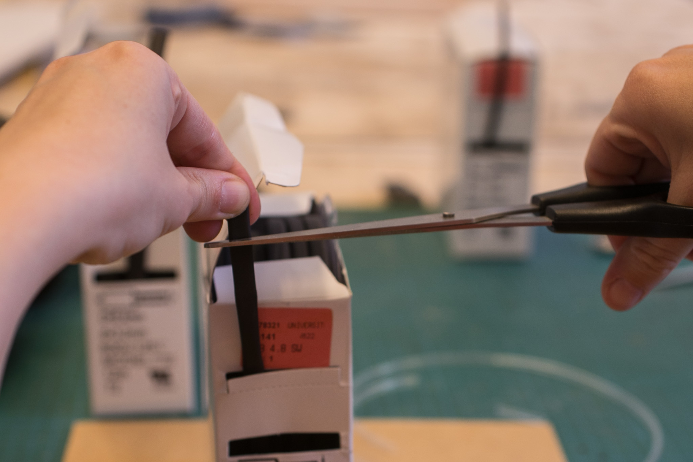

## Workspace

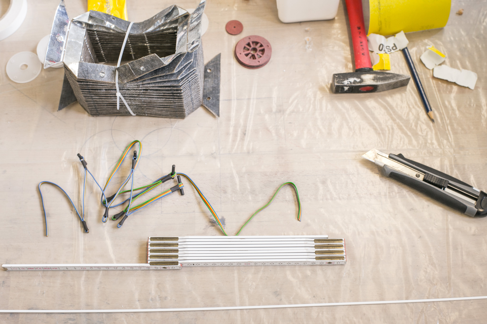

## End Result

## Template

*Template for the template*

*Drill holes*

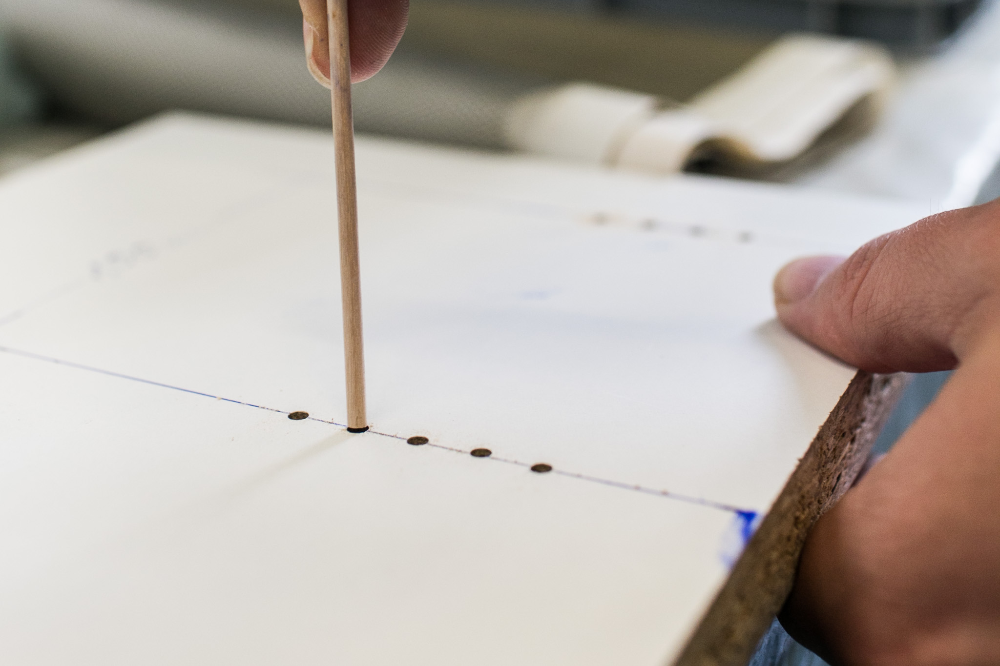
*Fit tooth picks*

*Completed template*

## Folding

*Fold cable around toothpick*

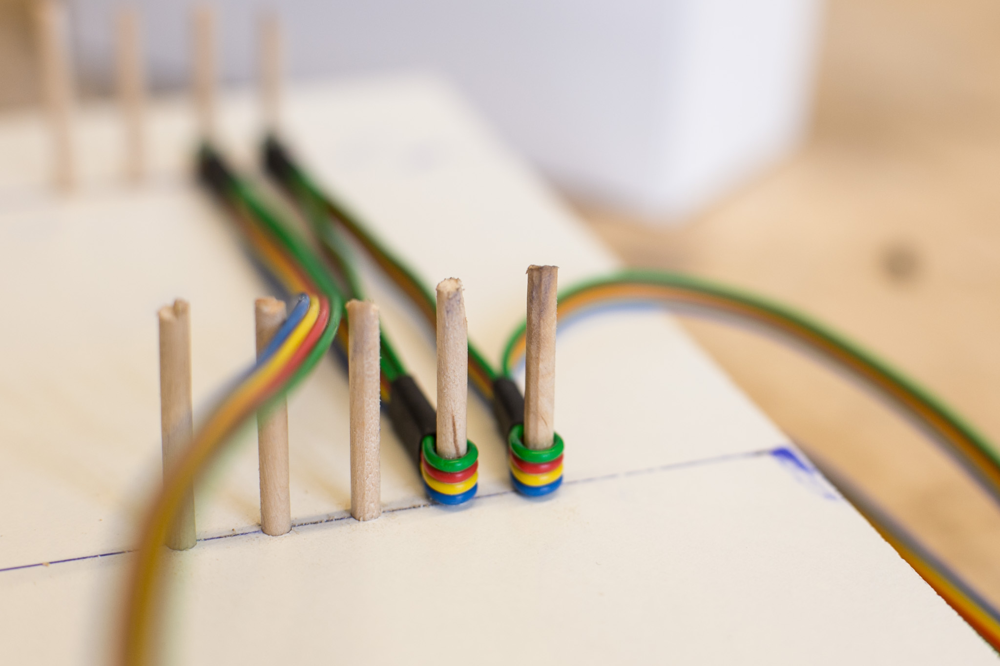
*Regularly lined up cables*

*Shrink shrinking tubing with lighter while cable is attached to template*

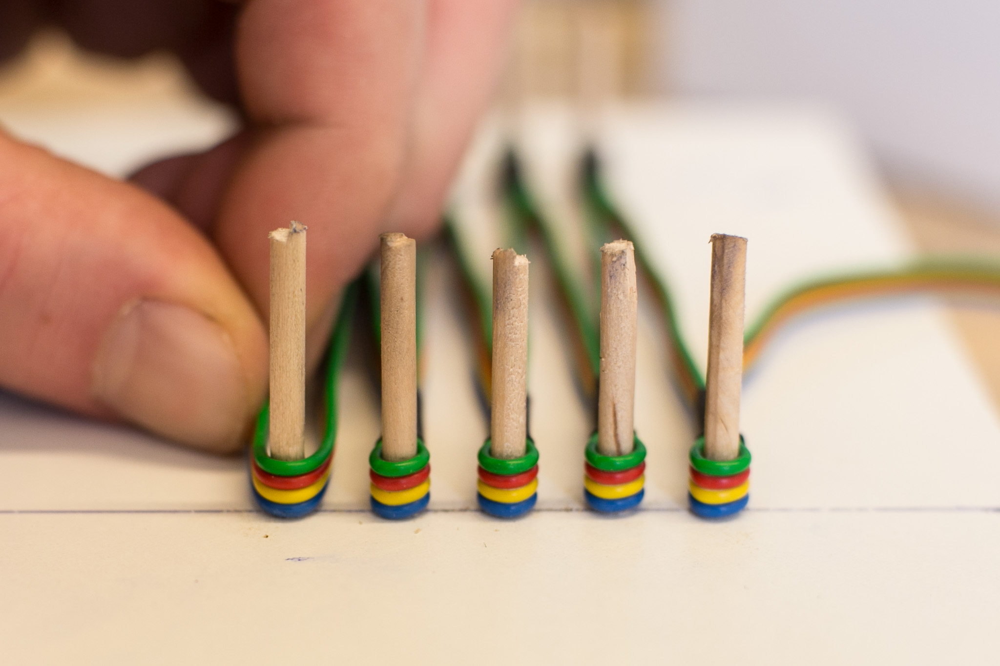
*Continue folding cable around toothpick*

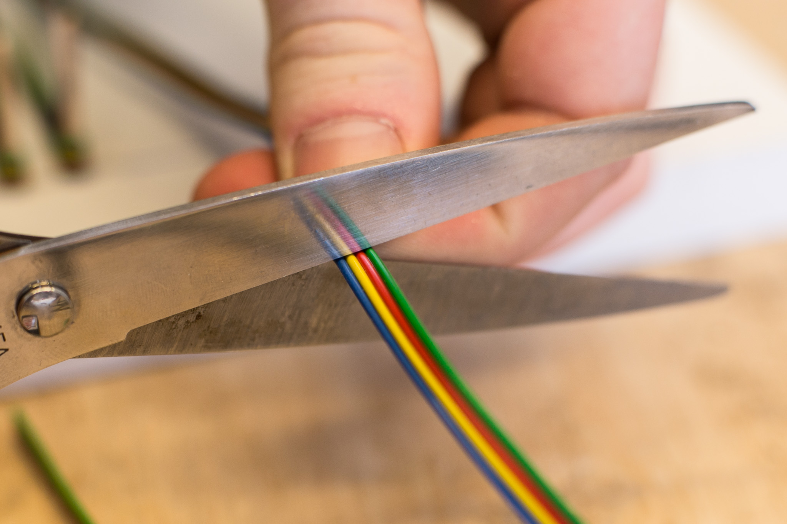
*Cut cable with scissors. Leave enough space for the connection, at least 15cm on each side.*

## Hinges

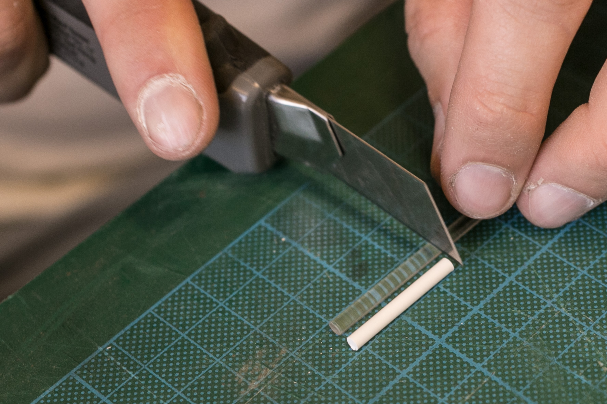
*Cut nine 3cm long pieces from the acryllic rod.*

*Poke a rod through one of the holes of the cable and add shrinking tube on both ends. Be sure to leave just enough space for the rod to move freely.*

*Use the lighter for shrinking.*

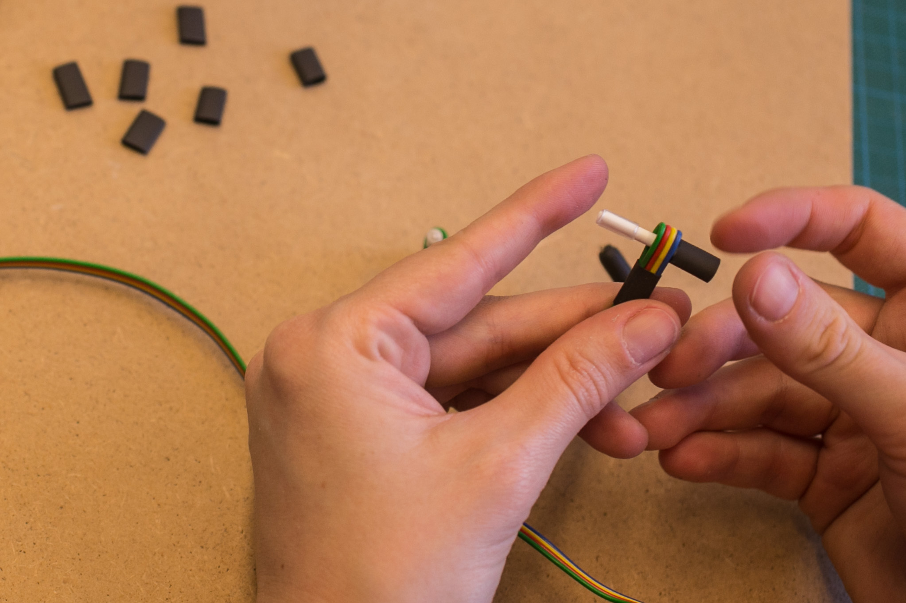
*Add layers of shrinking tube until the rod ends are slightly thicker than the cable going around the rod.*

*The resulting hinge should be easy to turn around and the ribbon cable should be slightly less thick than its outer parts.*

## Assembly to Bellow

*For this part, you need the completed bellow.*

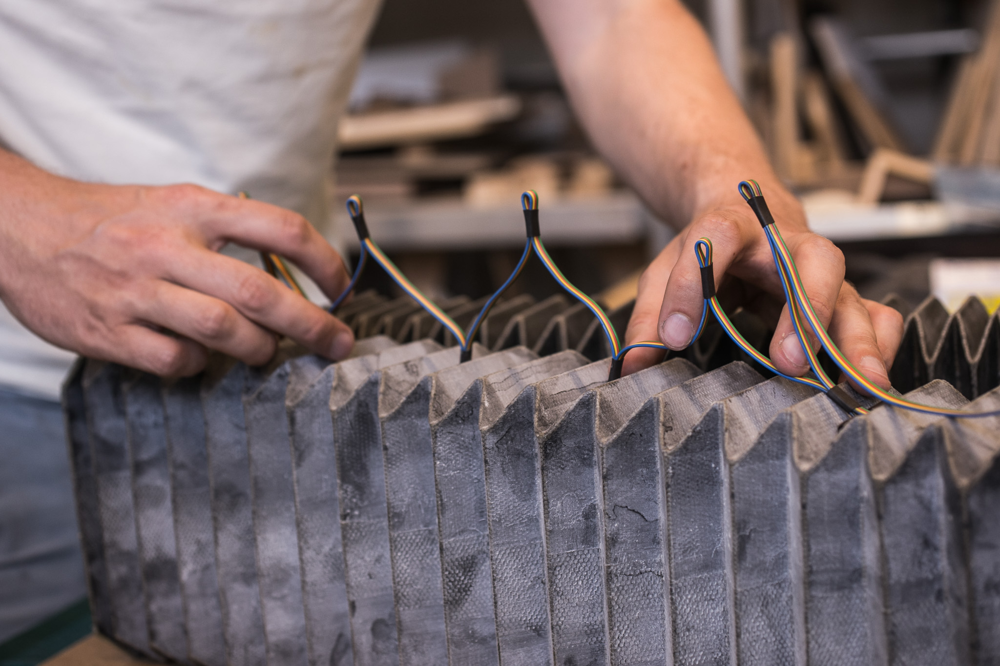
*Use the bellow to measure to which folds the hinges should be attached to.*

*Get help from another person to fix the bellow and attach the cable hinges to its inside folds with tape.*

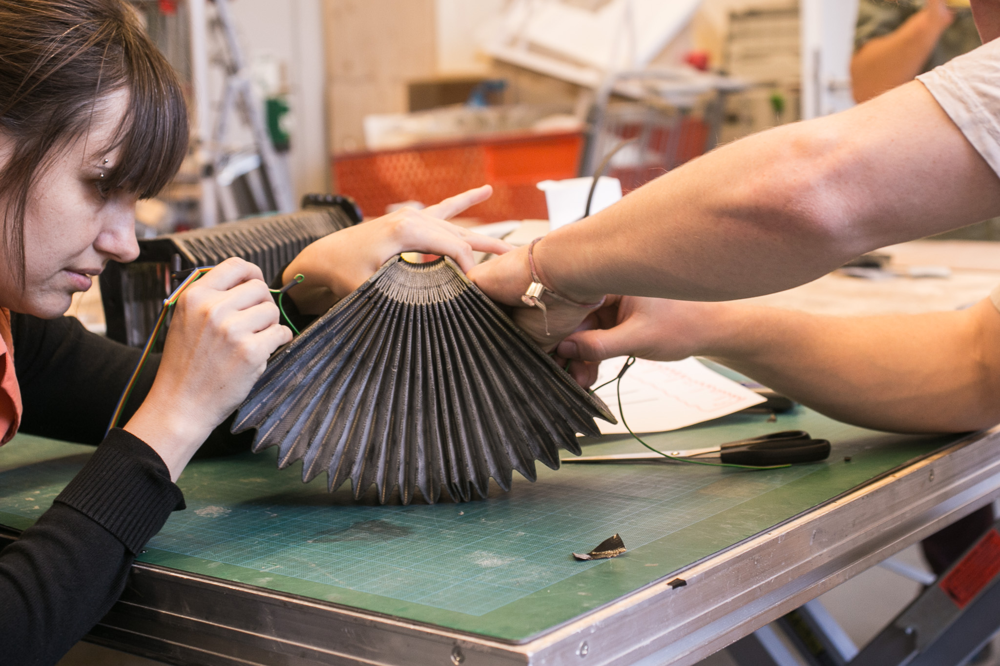
*This can be quite tricky and needs some time and concentration.*



*.*


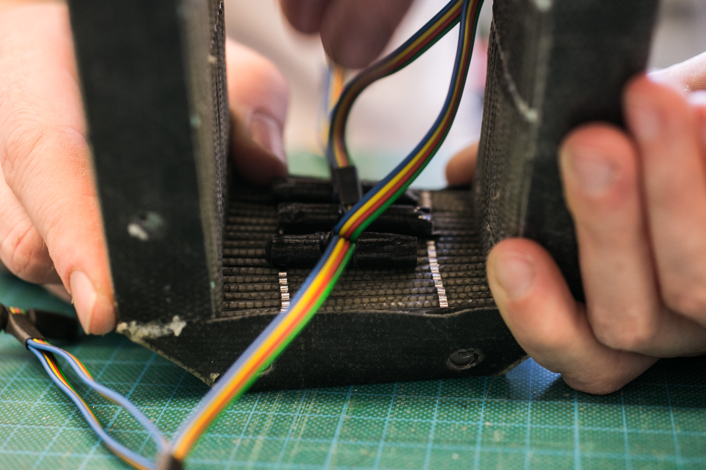
*.*

*.*
