## Steps

* taping
* filling
* sanding
* varneshing

## Tools

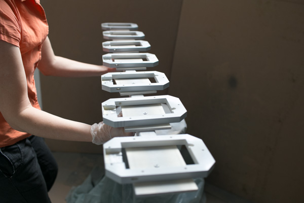*device to varnish solid parts: hand-bloc and top part ring (it is important that wet varnished edges do not touch the ground!)*

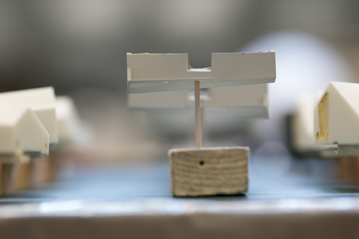*device to varnish finger parts*

* taping
	- tape
	- wooden sticks for applying tape into edges
	- cutter
* filling
    - scraper
    - piece of scrap-wood to prepare 2K filling material
* sanding
	- sanding blocks (cork for lower box, acrylic glass for wet sanding of 3D printed parts)
    - sandpaper (P240, P400, P600)
	- bowl of water
	- papertowels
* varneshing
	- two triangular sticks for varneshing lower box
	- devices/supportconstructions for varnishing elements of top part
	
## Materials

+ 2K fine filler
+ plastic primer
+ spray putty
+ filler
+ varnish

## Workspace

*worspace (wet) sanding*

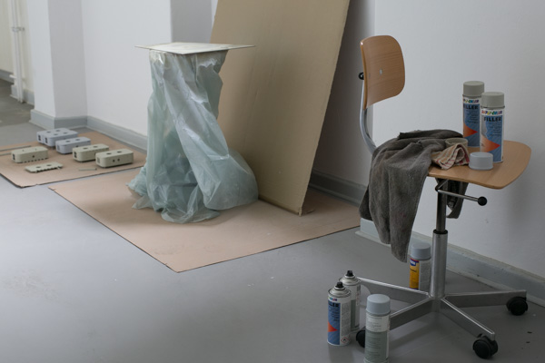*worspace varnishing*

## End Result

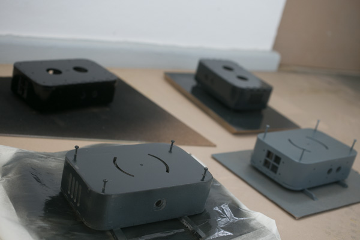*varnished box*

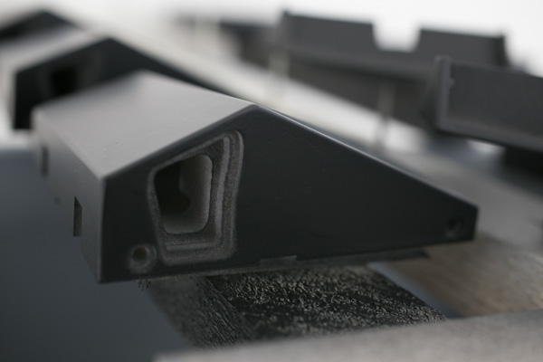*varnished top part (Hand-bloc)*

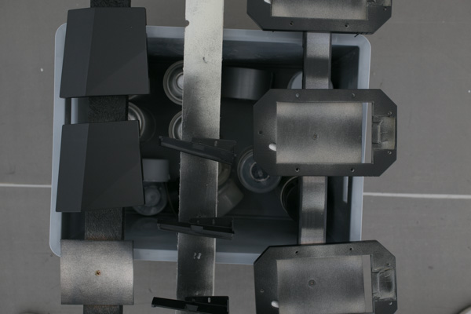*varnished top parts (from left to right: hand-bloc, finger part, top part ring)*

## spachteln

You should use a 2K putty to fill gaps and dents in between parts or on surface. To prepare putty follow instructions on package. It is a good idea to apply putty in between layers of grounding coates, because most filling pastes need to be covered with a primer before applying final colour. For really big gaps you can apply putty even before applying first layer of filler.

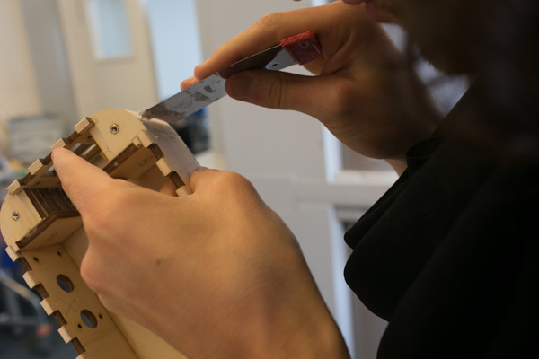*Apply 2K fine putty on sanded box where necessary. Have a look especially at the round edges where lower box parts were glued together*

Repeat this procedure after applying first layer of filler if neccessary.

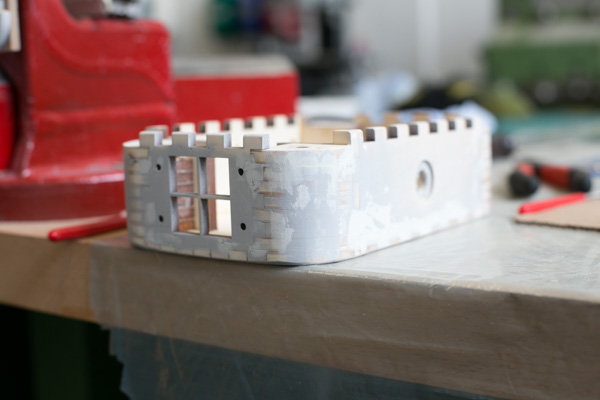*lower box after filling an sanding once with additional 2k fine putty just applied ready to dry*

## sanding

+ sanding block (cork)
+ sandpaper (P240, P400)

The lower box needs to be sanded in between applying layers of ground coat. The first layer should be sanded with P240 beacause you will have to sand off redundant putty. For the second layer you should use P400 paper, fold it in half and sand by hand.

*Do not worry if you will sand off filler at certain areas. You will have to apply a sencond layer anyways. It is most important to end up with an even surface after the first round of sanding. That way you will have less problems sanding the second layer of filler.*

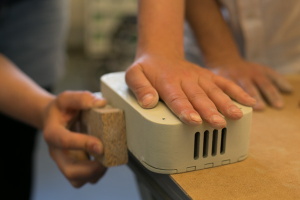*for sanding lower box use a corc bloc to fold sending paper around. Sand in circular movement. round off edges!*

*after sanding the surface should be evenly wan*

## Taping

before varnishing tape needs to be applyed carefully on every area which is not supposed to be covered by varnish. This includes surfaces where capacativ sensors will be attached to, holes for screws (top part and lower box) and the area where the lipo-charger will be glued on.

+ tape
+ pointed wooden stick or something similiar to get into small corners
+ cutter

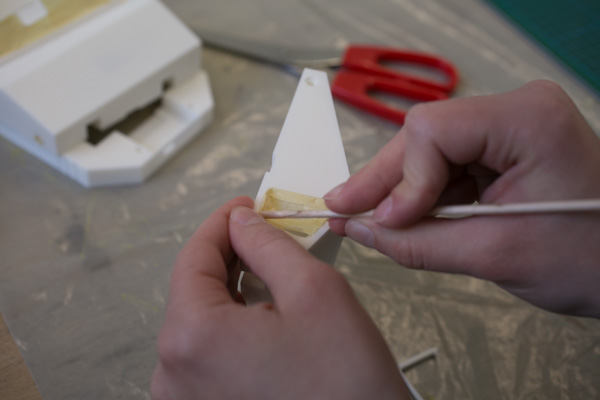*using pointed wooden sticks for applying tape on capacativ sensing area for the thumb*

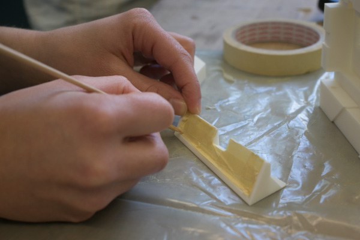*using pointed wooden sticks for applying tape on capacativ sensing area for the fingers*

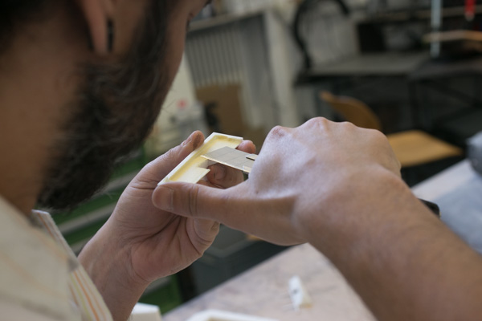*cutting of extra tape off close to edges of part*

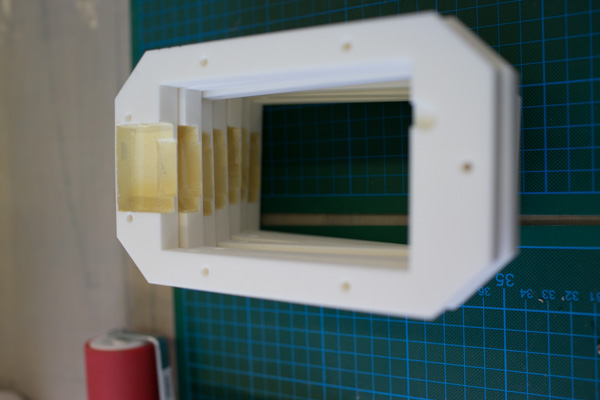*area where tape needs to be applied on top part ring*

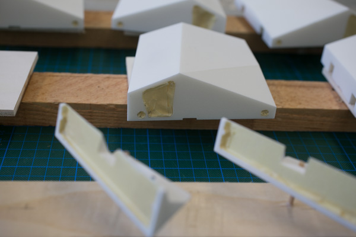*top- and finger-parts positioned on lackierzulagen ready to be varnished, holes and capacative sensing areas covered with tape*

## Wet Sanding

+ sanding block (cork, acrylic resin)
+ sandpaper (P200, P400, P600)
+ bowl of water
+ papertowels

Wet sanding sanding is necessary between applying layers of filler and varnish on all 3D printed plastic parts. Do not sand after applying the plastic primer! Depending on which spray putty you use you probably wont have to sand either.

*start sanding the 3D printed parts with P400 after you have applied the plastic primer, spray putty and a first layer of filler. sand wet, meaning that you should stick the sanding paper into water everey once in a while and use an acylic glas bloc to fold sandin paper around. For small surfaces and edges fold sanding paper in half and use your fingers.*

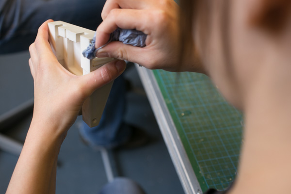*after sanding dry each part with paper towel. make sure that surfaces are evenly wan.*

## Varneshing Top Parts

Before varnishing 3D printed parts plastic primer needs to be applied, otherwise the varnish wont stick to the surface. Wait approxamately for 30min (see instructions on primer). Do not sand! Directly apply spray putty afterwards. In general: When you spray paint it is always a good idea to apply two thinner layers than on thicker layer. Paint tends to drip and leaves unpleasant noses on the surface. Same thing holds true for spray putty and filler, even they have less viscosity. Spray upright surfaces from bottom to top. Keep even distance and angle to surfaces and move from left to right with an approximate even speed. It is all about even layer thickness especially when it comes to sanding later on!

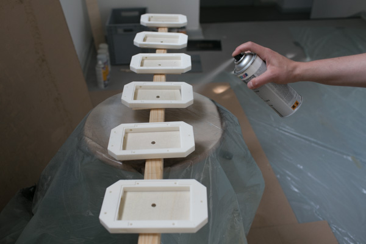*Applying plastic primer on top part ring. Edges should be sprayed in 45 degree angle, surfaces rectangular.*

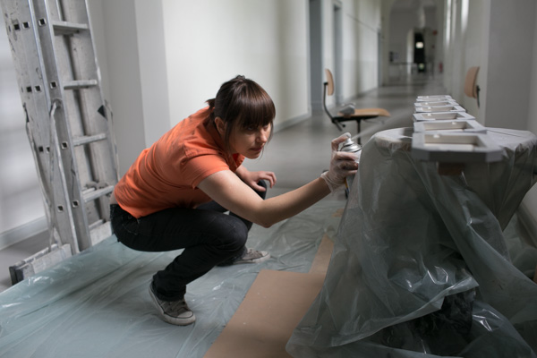*make sure to cover bottom edges as well, when applying spray putty, filler and varnish!*

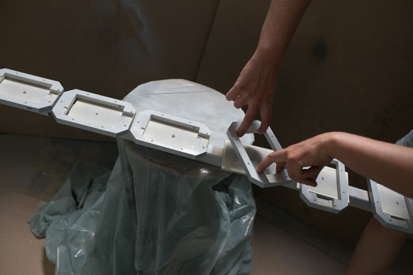*turn top part rings by grabbing them from the inside. note that the wooden plates are smaller in the rings footprint! that way wet edges wont stick to the ground while drying.*

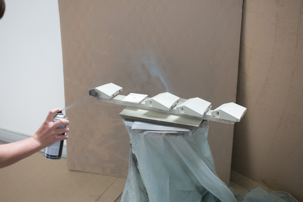*Applying varnish on top part hand-bloc after having sufficiently filled and sanded surfaces. note that it is a good idea starting with the upright surfaces all around and then work your way over the top edges towards the top surfaces.*

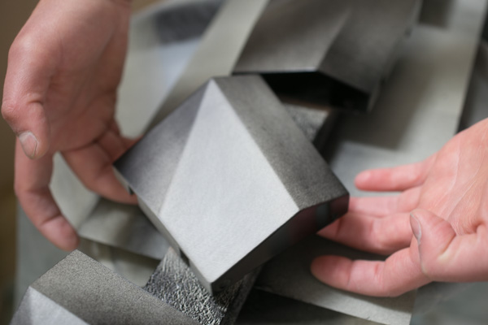*turning top part so that front sides can be varnished.*

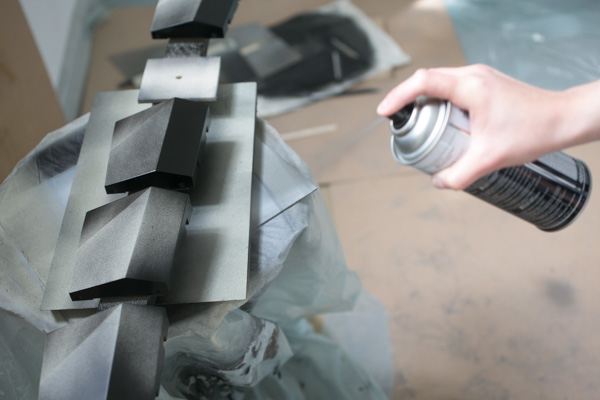**working your way over the edges (with 45 degree angle) to the to surfaces (with a 90 degree angle).

## Varneshing Lower Box

The lower box needs to be ground coated with a a appropriate filler. This closes the the surface and protects coloured varnish from sinking into the pores of the material. Similiar to the platic parts filler should rather be applyed in several thin layers than in one thick layer which will take forever to dry.

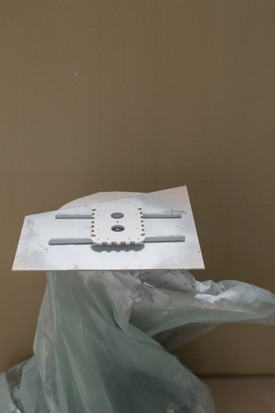*To varnish lower box you should use 2 triangular sticks to put parts on*

*Move the spray paint in same speed and distance over the surface. Move from left to right and slowly from front to back. Then turn the piece in 90 degrees an di the same again. Wait for 30 minutes and spray the backside. The lid needs to be filled from both sides otherwise it might curve.*

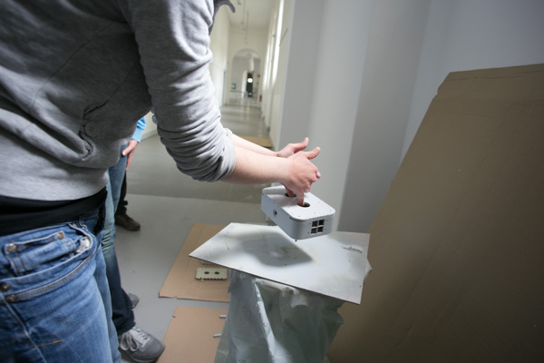*For the last layer of filler and final varnish put lid into box and spray them all together. Put srews in the wholes of the box to have feet to stand on and to protect them from filling up with paint.*

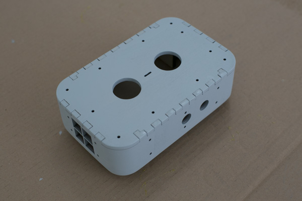*final layer of filler. Aim to end up with an even an closed surface. Sand on last time.*

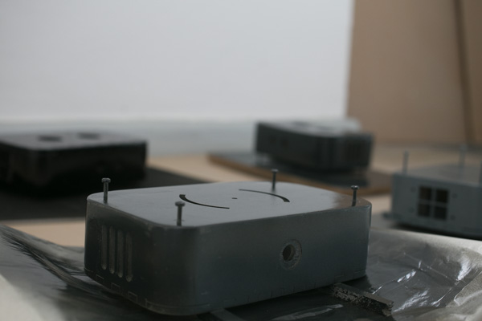*Spray upright surfaces and bottom part first. Wait for 30minutes.*

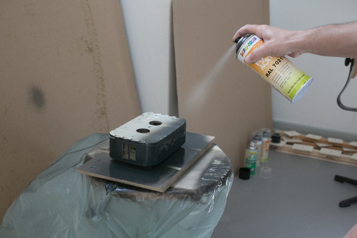*Turn box around and paint upright surfaces and lid.*

